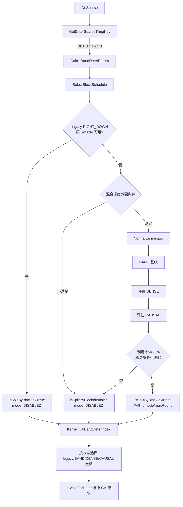

# FAG arch35 非 TND 确定性 BAND 三模式混合调度设计文档

| 项目         | 内容                                                                   |
| ------------ | ---------------------------------------------------------------------- |
| 文档版本     | v1.0                                                                   |
| 日期         | 2026-08-28                                                             |
| 状态         | 以当前 C++ 实现为最终行为基线                                          |
| 目标平台     | arch35（Ascend 950PR/Ascend 950DT）                                    |
| 目标场景     | 非 TND、确定性`DETER_BAND`、`G=1`、`BN2GS1S2`                    |
| 候选调度     | `BAND`、`DENSE`、`CAUSAL`                                        |
| 算子代码基线 | `ops-transformer` 分支 `david_0827_log_fix`，提交 `a5fcada556ac` |
| Python 镜像  | [`band_hybrid.py`](./band_hybrid.py)                                  |

## 1. 摘要

本文设计面向 FAG arch35 非 TND 确定性 BAND 场景，在保持确定性写冲突约束的前提下，根据有效区几何和预计轮次，在三种坐标调度间选择当前最优方案：

- `BAND`：按 BAND 有效列分段和配对，直接调度有效区域。
- `DENSE`：调度包围 BAND 的稠密矩形，再由既有稀疏有效性检查过滤无效块。
- `CAUSAL`：把近下三角 BAND 嵌入更大的下三角，复用 causal Swizzle；融合 Batch 为奇数时增加单 Batch 确定性尾段。

三种模式不是固定几何优先级。Host 先构造 `BAND` 基线，再依次评估 `DENSE`、`CAUSAL`；候选轮次只有严格小于当前最优值时才替换，平局保留较早模式。完成候选选择后，还必须同时通过以下准入门槛：

1. 有效槽位率不低于 90%。
2. 相对 legacy 最大轮次的增长不超过 3%。

如果任一门槛不满足，Host 返回 `DISABLED` 并回退旧确定性 BAND 调度。当前 Python 脚本完整镜像三种候选和坐标公式，但没有建模这两道最终门槛；本文对这一差异单独说明。

## 2. 背景与目标

确定性 FAG 不能依赖多核对同一输出地址进行不固定顺序的并发累加。对融合坐标 `(B*N2, S1Outer, S2Outer)`，调度需要满足：

1. 同一融合 Batch、同一 S1 行、同一轮次只由一个核处理，避免 dQ 同地址并发写。
2. 同一融合 Batch 的同一 S2 列固定归属一个物理核，保证 dK/dV 的列方向累加顺序稳定。
3. BAND 有效块全部覆盖且只处理一次。
4. 调度轮次和无效槽位开销受控，不能因几何变换造成明显性能回退。

单一 BAND 公式可以覆盖功能，但不同形状下不一定具有最少轮次：宽 BAND 更适合 DENSE 包围，接近下三角的 BAND 更适合 CAUSAL 嵌入，窄对角 BAND 则适合直接分段。三模式选择的目标是按实际轮次择优，同时保留明确的性能回退边界。

## 3. 设计范围

### 3.1 范围内

- arch35 确定性 Kernel。
- 非 TND layout。
- `deterSparseType == DETER_BAND`。
- `G == 1`，即 NoGQA。
- `BN2GS1S2` 核间切分。
- 两侧 Cube 基本块相等。
- BAND、兼容的 NO_MASK、非等长 RIGHT_DOWN_CAUSAL 归一化后的 BAND 几何。
- 偶数和奇数有效融合 Batch；CAUSAL 模式支持奇数尾 Batch。
- legacy RIGHT_DOWN_CAUSAL Swizzle 的兼容保留。

### 3.2 范围外

- TND/变长序列调度。
- `G > 1` 的 GQA BAND 调度。
- 两侧 Cube 基本块不相等的 split mode 1/2 混合调度扩展。
- FAG 数学计算、数据类型、API 和主体 CV 流水修改。
- `LEFT_UP_CAUSAL` 的专用非等长调度；该场景由独立的 `DETER_CAUSAL` 方案处理。

## 4. BAND 几何与参数映射

Python 和 Kernel helper 均使用 1-based 坐标。

| 符号             | Python 输入 | Host/Kernel 含义                                      |
| ---------------- | ----------- | ----------------------------------------------------- |
| `k`            | `k`       | Cube 核数，Host 为`aicNum`，Kernel 为 `coreNum/2` |
| `m`            | `m`       | 归一化后的`S1Outer`                                 |
| `n`            | `n`       | 归一化后的`S2Outer`                                 |
| `p`            | `p`       | S1 token 换算到基本块后的左/下带宽参数                |
| `q`            | `q`       | S2 token 换算到基本块后的右/上带宽参数                |
| `b`            | `b`       | 有效融合 Batch 数`(B-tailZeroCount)*N2`             |
| `j`            | core        | 1-based Cube 核编号`cBlockIdx+1`                    |
| `r`            | round       | 1-based 轮次`roundId+1`                             |
| `(w,x,y)`      | coordinate  | 1-based 融合 Batch、S1 块、S2 块                      |
| `hostMaxRound` | 脚本未提供  | `CalcleBandDeterParam` 计算的 legacy Host 轮次      |

Host 首先把元素级 token 换算成块级参数：

```text
cubeBase = s1Inner*s1CvRatio = s2Inner*s2CvRatio
p = CeilDivideBy(s1Token, cubeBase) + 1
q = CeilDivideBy(s2Token, cubeBase) + 1
```

因此 `band_hybrid.py --case` 接收的 `p/q` 已是块级参数，不是原始元素级 token。

归一化后的每个 Batch 有效集合为：

\[
\Omega=\{(x,y)\mid 1\le y\le n,\ \max(1,y-q+1)\le x\le\min(m,y+p-1)\}
\]

## 5. 总体控制流



## 6. Host 外围入口与状态语义

### 6.1 混合三模式外围条件

进入 `SelectDeterBandSchedule` 前需满足：

```text
enableSwizzle
&& layoutType != TND
&& splitAxis == BN2GS1S2
&& s1Inner*s1CvRatio == s2Inner*s2CvRatio
&& sparseType != UNSUPPORTED
&& isDeterministic
&& deterSparseType == DETER_BAND
&& G == 1
&& coreNum == 2*aicNum
&& actualBatch = (B-tailZeroCount)*N2 > 0
```

与 legacy causal/dense Swizzle 不同，一般 `DETER_BAND` 混合入口不要求融合 Batch 为偶数，也不要求 `S1 >= aicNum*128`。奇数 Batch 可由 BAND、DENSE 直接覆盖，CAUSAL 则通过单 Batch 尾段覆盖。

### 6.2 `isSplitByBlockIdx` 与 mode 的联合状态

`DISABLED` 不能单独解释为“未使用 Swizzle”，必须与 `isSplitByBlockIdx` 联合判断。

| `isSplitByBlockIdx` | `deterBandScheduleMode` | Kernel 行为                                 |
| --------------------: | ------------------------- | ------------------------------------------- |
|             `false` | `DISABLED`              | legacy`GenBandInfo + CalBandIndex`        |
|              `true` | `DISABLED`              | legacy RIGHT_DOWN_CAUSAL Swizzle            |
|              `true` | `CAUSAL`                | lower causal embedding，支持奇数尾 Batch    |
|              `true` | `DENSE`                 | `CalDenseSwizzleIndex` 后过滤 BAND 无效块 |
|              `true` | `BAND`                  | `GenBandHybridInfo + CalBandHybridIndex`  |

Host 将两者分别写入 TilingData；`deterBandScheduleMode` 是 `uint8_t` 枚举：`0/1/2/3 = DISABLED/CAUSAL/DENSE/BAND`。

### 6.3 legacy RIGHT_DOWN_CAUSAL 优先级

如果 `sparseMode == RIGHT_DOWN_CAUSAL` 且原有 Swizzle 的全部条件已经满足，Host 直接保留旧路径，不进入三模式选择：

```text
rightDownBandCond
&& canSplitByBlockIdx
&& original(B*N2) 为偶数
&& G == 1
&& S1 >= aicNum*128
```

此时 `isSplitByBlockIdx=true`、`mode=DISABLED`。Kernel 继续使用 `CalCausalSwizzleIndex` 和旧最大轮次公式，避免重新选择 DENSE 后增加轮次。

对 EOD 尾零场景，旧入口的偶数判断使用原始 `B*N2`，而 TilingData 中的 B 已扣除 `tailZeroCount`；因此原始融合 Batch 为偶数、有效融合 Batch 为奇数时，仍可能保留旧入口并按有效 B 计算坐标。

## 7. 参数归一化

### 7.1 负 token 转换

Host 和 Kernel 首先限制上界，再把负 token 引起的偏移转换为有效子矩形：

```text
p = min(p,m)
q = min(q,n)

if p < 0:
    (m,n,p,q) = (m,n+p,1,p+q)
    nOffset = -p_old
elif q < 0:
    (m,n,p,q) = (m+q,n,p+q,1)
    mOffset = -q_old
```

Kernel 在坐标计算后通过 `mOffset/nOffset` 恢复到原始外层坐标。Python 脚本只验证归一化后有效子矩形，没有把偏移加回原始坐标，这是脚本覆盖边界之一。

### 7.2 空行空列裁剪

`GenBandHybridInfo` 再执行：

```text
p = min(p,m)
q = min(q,n)
m = min(m,n+p-1)
n = min(n,m+q-1)  // 使用更新后的 m
```

该裁剪去除 BAND 几何中整行或整列无效的外围区域，后续三种候选都在同一有效包围矩形上比较。

## 8. BAND 基线设计

### 8.1 三段划分

根据 `p+q` 与 `m` 的关系，将 S2 列划分为 `L1/L2/L3` 三段。

当 `p+q <= m`：

\[
L1=q-1
\]

\[
L2=\min(n-q+1,m+2-p-q)
\]

\[
L3=\max(0,\min(p+n-m-1,p+q-2))
\]

\[
bandBlocks=\frac{(2p-2+q)L1}{2}+(p+q-1)L2+(p+q-2)L3-\frac{L3(L3-1)}{2}
\]

当 `p+q > m`：

\[
L1=m-p,\qquad L2=p+q-m,\qquad L3=\min(n-q,m-1)
\]

\[
bandBlocks=\frac{(p+m-1)L1}{2}+mL2+\frac{(2m-1-L3)L3}{2}
\]

`bandBlocks` 是单个融合 Batch 的有效基本块数。

### 8.2 首尾列配对

段 1 与段 3 的部分列具有互补的有效轮次区间，可以共用一个高度为 `slot=p+q-1` 的虚拟列：

\[
hybridPairCount=\max(0,\min(L1,L3-p+1))
\]

\[
colsPerBatch=L1+L2+L3-hybridPairCount
\]

于是 BAND 基线轮次为：

\[
bandRound=\left\lceil\frac{b\cdot colsPerBatch}{k}\right\rceil(p+q-1)
\]

### 8.3 BAND 坐标分发

对核 `j` 和轮次 `r`：

\[
layer=\left\lfloor\frac{r-1}{slot}\right\rfloor,\qquad localRound=(r-1)\bmod slot+1
\]

\[
globalColumn=layer\cdot k+j
\]

`globalColumn` 决定融合 Batch 和 Batch 内虚拟列。对于已配对列，先尝试段 1 的实际列；该列在当前 `localRound` 无效时，再映射到段 3 的互补列。中间段和未配对列直接映射。最终统一使用：

\[
x=y+localRound-q
\]

并检查 BAND 有效区。一个虚拟列从头到尾固定在同一核，因此其中承载的实际列也不会跨核。

## 9. DENSE 候选设计

DENSE 候选在完整 `m*n*b` 矩形上调用 `CalDenseSwizzleIndex`，再由 `IsValidForDeter` 过滤 BAND 外部块。

\[
denseK=\min(k,m\cdot b)
\]

候选安全条件：

```text
denseK == k
&& min(denseK,n) <= m
```

- `denseK == k` 保证 Dense helper 不会在 Kernel 内减少活跃核数，从而破坏 Host 轮次假设。
- `min(denseK,n) <= m` 保证同一 Batch 同一轮发射的列数不会绕过 m 后撞到相同 S1 行。

候选轮次：

\[
denseRound=\left\lceil\frac{n\cdot b}{denseK}\right\rceil m
\]

仅当 `denseRound < currentBestRound` 时选择 DENSE；若与 BAND 平局，仍保持 BAND。

## 10. CAUSAL 候选设计

### 10.1 lower causal embedding

将 BAND 的 S1 坐标平移：

\[
x'=x+q-1
\]

则 BAND 的下界 `x >= y-q+1` 转换为 `x' >= y`，可以嵌入边长为：

\[
lowerSize=m+q-1
\]

的下三角。另一个上三角方向候选大小为：

\[
upperSize=n+p-1
\]

对应浪费块数：

\[
lowerWaste=\frac{lowerSize(lowerSize+1)}{2}-bandBlocks
\]

\[
upperWaste=\frac{upperSize(upperSize+1)}{2}-bandBlocks
\]

当前实现只允许 lower embedding：

```text
bandBlocks > 0
&& 0 <= lowerWaste <= upperWaste
&& lowerWaste <= floor((bandBlocks-1)/10)
```

upper embedding 即使几何上可行也不转置使用，因为转置会破坏原始 S2 列固定归核约束。

### 10.2 偶数配对段

\[
pairCount=\left\lfloor\frac{b}{2}\right\rfloor
\]

\[
causalK=\min(k,lowerSize\cdot pairCount)
\]

准入条件：

```text
pairCount > 0
&& causalK == k
&& causalK <= lowerSize
```

配对段轮次：

\[
pairRound=lowerSize\cdot\left\lceil\frac{(lowerSize+1)pairCount}{causalK}\right\rceil
\]

前 `2*pairCount` 个融合 Batch 使用 `CalCausalSwizzleIndex` 成对拼接。

### 10.3 奇数尾 Batch

当 `b` 为奇数时，最后一个融合 Batch 由 `CalCausalSingleBatchDeterIndex` 单独调度。令 `L=lowerSize`：

\[
groupCount=\left\lfloor\frac{L}{2k}\right\rfloor
\]

\[
groupRound=(2L+1)groupCount-2k\cdot groupCount^2
\]

\[
remain=L-2k\cdot groupCount
\]

\[
tailRound=
\begin{cases}
groupRound+remain,&remain\le k\\
groupRound+\max(remain,2\cdot remain-2k+1),&remain>k
\end{cases}
\]

CAUSAL 总轮次：

\[
causalRound=pairRound+tailRound
\]

Kernel 以 `pairRound` 为阶段边界：前半调用配对 Swizzle，后半调用单 Batch helper 并把 `batchId` 固定为最后一个融合 Batch。最后执行 `x=x'-(q-1)` 并过滤 BAND 外部 padding。

CAUSAL 仅在 `causalRound < currentBestRound` 时替换当前模式。

## 11. 模式选择与最终准入

### 11.1 严格轮次择优

```text
bestMode  = BAND
bestRound = bandRound

if denseEligible and denseRound < bestRound:
    bestMode  = DENSE
    bestRound = denseRound

if causalEligible and causalRound < bestRound:
    bestMode  = CAUSAL
    bestRound = causalRound
```

因此平局顺序是“先出现者保留”：BAND 优先于与其平局的 DENSE；若 DENSE 已严格胜出，则 DENSE 优先于与其平局的 CAUSAL。这只是平局规则，不是脱离轮次比较的固定模式优先级。

### 11.2 槽位利用率门槛

三种混合模式每轮都遍历 `k` 个槽位：

\[
validSlotNum=bandBlocks\cdot b
\]

\[
totalSlotNum=k\cdot bestRound
\]

要求：

\[
\frac{validSlotNum}{totalSlotNum}\ge90\%
\]

无效坐标虽不进入主体计算，仍产生轮次遍历和索引计算开销，因此低利用率方案直接回退。

### 11.3 相对 legacy 轮次门槛

Host 先构造 legacy 上界。下式使用负 token 转换完成、但空行空列裁剪前的有效参数：

\[
legacyRm2=
\begin{cases}
m\left\lceil\frac{nb}{\min(k,bm)}\right\rceil,&p+q>m\\
\left\lceil\frac{nb}{k}\right\rceil(p+q-1),&p+q\le m
\end{cases}
\]

\[
legacyMaxRound=\max(hostMaxRound,legacyRm2)
\]

要求：

\[
bestRound\le1.03\cdot legacyMaxRound
\]

如果利用率或轮次增长任一条件失败，`SelectDeterBandSchedule` 返回默认 `DISABLED` 结果。

## 12. Kernel 路由与执行闭环

### 12.1 Tiling 数据

Host 下发：

- `isSplitByBlockIdx`
- `deterBandScheduleMode`
- `baseDeterParam.deterMaxRound`
- 原有 S1/S2 切分、token 和基础 shape 参数

CAUSAL 模式的总轮次包含奇数尾段，Kernel 直接读取 Host 序列化的 `deterMaxRound`。DENSE 和 BAND 模式根据 `BandInfo` 重算与 Host 相同的轮次公式。

### 12.2 坐标分发

`CalBandDeterIndex` 按联合状态路由：

```text
mode == CAUSAL -> CalCausalSwizzleIndex / CalCausalSingleBatchDeterIndex
mode == DENSE  -> CalDenseSwizzleIndex
mode == BAND   -> CalBandHybridIndex
mode == DISABLED && split -> legacy RIGHT_DOWN CalCausalSwizzleIndex
mode == DISABLED && !split -> legacy CalBandIndex
```

坐标 helper 返回后，Kernel：

1. 恢复负 token 归一化产生的 `mOffset/nOffset`。
2. 将 1-based 融合 Batch 拆为 B/N2/G。
3. 转换为内部 0-based S1/S2 坐标。
4. 通过 `IsValidForDeter` 做真实 token、尾块和稀疏边界过滤。
5. 由 `CalDeterIndex` 扫描下一个有效任务。
6. 沿用 `Process_NEW_DETER` 的 ping-pong CV 流水。

## 13. 正确性约束

### 13.1 完备性与唯一性

- BAND：三段及配对列枚举等于 BAND 理论有效集合。
- DENSE：矩形枚举覆盖 BAND，既有有效性检查删除补集。
- CAUSAL：lower triangle 覆盖平移后的 BAND，最后逆平移并删除 padding。
- 奇数 CAUSAL：配对段覆盖前 `b-1` 个 Batch，单 Batch helper 覆盖最后一个 Batch，轮次区间不重叠。

### 13.2 确定性约束

- 同一 `(batch,s2)` 列由唯一虚拟列或 dense/causal 列映射产生，固定归属一个核。
- 每轮 `(batch,s1)` 唯一，避免 dQ 同行同轮冲突。
- 相同 `k/m/n/p/q/b/mode` 产生固定坐标顺序和累加顺序。

### 13.3 终止性

每种模式的 `maxRound` 都是对应坐标 helper 的闭合上界。末尾不足 `k` 个虚拟列的槽位返回无效，`maxRound+1` 后不得再生成有效坐标。

## 14. 代表用例

| 用例`k,m,n,p,q,b`  | 模式   | BAND | DENSE |         CAUSAL | 最终轮次 | 有效坐标 | 槽位利用率 |
| -------------------- | ------ | ---: | ----: | -------------: | -------: | -------: | ---------: |
| `28,55,55,55,1,13` | CAUSAL | 1430 |  1430 | `660+55=715` |      715 |   20,020 |       100% |
| `28,55,55,55,1,12` | CAUSAL | 1320 |  1320 |  `660+0=660` |      660 |   18,480 |       100% |
| `28,55,55,55,55,2` | DENSE  |  436 |   220 |         不满足 |      220 |    6,050 |     98.21% |
| `28,55,55,3,3,2`   | BAND   |   20 |   220 |         不满足 |       20 |      538 |     96.07% |

第一个用例中 BAND 与 DENSE 平局，因此保持 BAND；随后 CAUSAL 严格减少轮次并胜出。奇数第 13 个 Batch 使用 55 轮尾段，全部 28 个核负载均为 715。

## 15. Python 镜像覆盖范围与实现差异

### 15.1 已一致的部分

- `NormalizeDeterBandScheduleParams` 的有效子矩形变换。
- `L1/L2/L3`、`bandBlocks`、配对列和 BAND 坐标公式。
- BAND 基线、DENSE 和 CAUSAL 候选条件与严格小于规则。
- 偶数 causal 配对和奇数单 Batch 尾段。
- 坐标覆盖、唯一性、同行同轮互斥和列固定归核验证。
- legacy RIGHT_DOWN 的判定和轮次公式以独立 helper 表达。

### 15.2 尚未镜像的 C++ 行为

| 差异                                           | 影响                                                   |
| ---------------------------------------------- | ------------------------------------------------------ |
| 未接收`hostMaxRound`                         | 无法完整计算`legacyMaxRound`                         |
| 未执行 90% 槽位利用率门槛                      | 脚本可能选择 C++ 会回退的低利用率模式                  |
| 未执行 3% 轮次增长门槛                         | 脚本可能保留 C++ 会回退的候选                          |
| 外围入口未集成进`select_deter_band_schedule` | 调用方需自行保证 layout、G、splitAxis、CubeBase 等条件 |
| RIGHT_DOWN legacy 仅以辅助函数验证             | 脚本主调度不会自动进入该特殊联合状态                   |
| 负 token 仅验证有效子矩形                      | 未把`mOffset/nOffset` 恢复到原始坐标                 |

低利用率反例：

```text
k,m,n,p,q,b = 1,2,2,1,2,1
Python: mode=BAND, maxRound=4, coordinates=3, verify=PASS
C++ Host: validSlot/totalSlot=3/4=75% < 90%，返回 DISABLED 并回退 legacy
```

因此脚本的 `PASS` 表示“所选坐标算法自洽”，不等价于“当前 C++ Host 最终一定选择该模式”。

## 16. 验证结果与建议

### 16.1 已执行 Python 验证

```powershell
python .\band_hybrid.py --case 28 55 55 55 1 13
python .\band_hybrid.py --case 28 55 55 55 1 12
python .\band_hybrid.py --case 28 55 55 55 55 2
python .\band_hybrid.py --case 28 55 55 3 3 2
python .\band_hybrid.py --full-test
```

结果：

```text
CAUSAL odd : PASS, maxRound=715, coordinates=20020
CAUSAL even: PASS, maxRound=660, coordinates=18480
DENSE      : PASS, maxRound=220, coordinates=6050
BAND       : PASS, maxRound=20,  coordinates=538
PASS full-test cases=292 coordinates=203968
```

脚本验证项包括：

1. 三个模式分支及预期 `maxRound`。
2. 理论 BAND 坐标全覆盖。
3. 无重复、无越界。
4. `maxRound` 后无有效坐标。
5. 同 Batch 同行同轮无冲突。
6. 同一实际 S2 列不跨核。
7. 偶数配对段与奇数尾段连续。

### 16.2 建议补充 Host UT

| 类别   | 场景                       | 预期                                 |
| ------ | -------------------------- | ------------------------------------ |
| 模式   | CAUSAL 偶数 Batch          | mode=CAUSAL，tailRound=0             |
| 模式   | CAUSAL 奇数 Batch          | mode=CAUSAL，maxRound 包含 tailRound |
| 模式   | 宽 BAND                    | mode=DENSE                           |
| 模式   | 窄 BAND                    | mode=BAND                            |
| 平局   | BAND 与 DENSE 同轮次       | 保持 BAND                            |
| 平局   | DENSE 与 CAUSAL 同轮次     | 保持 DENSE                           |
| 门槛   | 利用率低于 90%             | mode=DISABLED，回退 legacy           |
| 门槛   | 轮次增长超过 3%            | mode=DISABLED，回退 legacy           |
| 兼容   | legacy RIGHT_DOWN 条件满足 | split=true、mode=DISABLED            |
| 入口   | TND、GQA、CubeBase 不等    | 不进入三模式                         |
| 归一化 | p/q 为负                   | Host/Kernel offset 一致              |

### 16.3 建议补充 Kernel/算子测试

- FP16、BF16 下与 CPU 标杆比较 `dq/dk/dv`。
- BAND、NO_MASK、非等长 RIGHT_DOWN_CAUSAL 的模式覆盖。
- B/N2 组合产生的偶数、奇数融合 Batch。
- 正 token、负 token、S1/S2 尾块不对齐。
- 同一输入重复执行，检查 bitwise 确定性。
- 对比 legacy 与三种模式的轮次、槽位利用率和端到端耗时。

## 17. 兼容性、风险与回退

| 项目              | 说明与处理                                                        |
| ----------------- | ----------------------------------------------------------------- |
| API               | 不修改 aclnn/图算子接口                                           |
| Tiling ABI        | 使用`uint8_t deterBandScheduleMode`；Host/Kernel 枚举值必须同步 |
| legacy BAND       | `split=false, mode=DISABLED` 时完整保留                         |
| legacy RIGHT_DOWN | `split=true, mode=DISABLED` 时完整保留                          |
| 奇数 Batch        | 仅 CAUSAL 需要专用尾段，BAND/DENSE 可直接处理                     |
| 低利用率          | Host 90% 门槛主动回退                                             |
| 轮次回退          | Host 3% 门槛主动回退                                              |
| upper causal      | 禁止转置，避免原 S2 列跨核                                        |
| 负 token          | Host/Kernel 必须保持归一化顺序和 offset 一致                      |
| Python 漂移       | 建议补齐 Host 门槛参数并加入反向用例                              |

通用回退方式是让 `SelectDeterBandSchedule` 返回 `DISABLED`，保持 `isSplitByBlockIdx=false`，Kernel 即恢复 `GenBandInfo + CalBandIndex`。legacy RIGHT_DOWN 的特殊回退状态由 Host 提前返回保护。

## 18. 源码对应关系

| 模块               | 文件与位置                                                                                                                                                                                                                               | 作用                         |
| ------------------ | ---------------------------------------------------------------------------------------------------------------------------------------------------------------------------------------------------------------------------------------- | ---------------------------- |
| Python 归一化      | [`band_hybrid.py`](./band_hybrid.py)，约第 95/106 行                                                                                                                                                                                    | 负 token 转换、三段参数      |
| Python 选择器      | [`band_hybrid.py`](./band_hybrid.py)，`select_deter_band_schedule`（约第 156 行）                                                                                                                                                     | 三候选严格轮次择优           |
| Python BAND 坐标   | [`band_hybrid.py`](./band_hybrid.py)，`cal_band_hybrid_index`（约第 355 行）                                                                                                                                                          | BAND 虚拟列分发              |
| Python 统一路由    | [`band_hybrid.py`](./band_hybrid.py)，`schedule_coordinate`（约第 399 行）                                                                                                                                                            | 按模式产生坐标               |
| Python 验证        | [`band_hybrid.py`](./band_hybrid.py)，`verify_case/run_full_test`（约第 436/498 行）                                                                                                                                                  | 不变量和分支验证             |
| Host 单 Batch 轮次 | [`flash_attention_score_grad_tiling_normal_regbase.cpp`](../../../../ops-transformer/attention/flash_attention_score_grad/op_host/arch35/flash_attention_score_grad_tiling_normal_regbase.cpp)，约第 208 行                             | CAUSAL 奇数尾段上界          |
| Host 选择器        | 同上，`SelectDeterBandSchedule`（约第 247 行）                                                                                                                                                                                         | 三候选、90%/3% 门槛          |
| Host 外围路由      | 同上，`SelectBlockSchedule`（约第 341 行）                                                                                                                                                                                             | legacy RIGHT_DOWN 与混合入口 |
| Host 结果落盘      | 同上，约第 876、2305/2306、2328 行                                                                                                                                                                                                       | mode、split、maxRound        |
| legacy Host 轮次   | [`flash_attention_score_grad_tiling_common_regbase.cpp`](../../../../ops-transformer/attention/flash_attention_score_grad/op_host/arch35/flash_attention_score_grad_tiling_common_regbase.cpp)，`CalcleBandDeterParam`（约第 742 行） | `hostMaxRound`             |
| Tiling 枚举        | [`flash_attention_score_grad_tiling_data_regbase.h`](../../../../ops-transformer/attention/flash_attention_score_grad/op_kernel/arch35/flash_attention_score_grad_tiling_data_regbase.h)，约第 28 行                                    | mode ABI 定义                |
| 单 Batch Kernel    | [`deter.h`](../../../../ops-transformer/attention/flash_attention_score_grad/op_kernel/arch35/deter.h)，约第 405 行                                                                                                                     | CAUSAL 奇数尾 Batch          |
| BAND Kernel        | 同上，`GenBandHybridInfo/CalBandHybridIndex`（约第 1015/1057 行）                                                                                                                                                                      | BAND 参数及坐标              |
| Kernel 模式路由    | [`flash_attention_score_grad_kernel_deter.h`](../../../../ops-transformer/attention/flash_attention_score_grad/op_kernel/arch35/flash_attention_score_grad_kernel_deter.h)，`CalBandDeterIndex`（约第 497 行）                        | 按 mode 选择 helper          |
| Kernel 最大轮次    | 同上，`CalDeterMaxLoopNum`（约第 598 行）                                                                                                                                                                                              | legacy/三模式轮次闭环        |

## 19. 验收标准

1. Host 与 Kernel 对 `DeterBandScheduleMode` 的枚举值、归一化参数和轮次公式完全一致。
2. BAND、DENSE、CAUSAL 三模式均实现有效集合 100% 覆盖且无重复坐标。
3. 每轮 `(batch,s1)` 唯一，每个 `(batch,s2)` 固定在一个物理核。
4. 奇数 CAUSAL 的配对段和单 Batch 尾段边界连续，`maxRound+1` 后无任务。
5. 平局严格保持先前模式，低于 90% 利用率或超过 3% 轮次增长时回退 legacy。
6. legacy BAND 与 legacy RIGHT_DOWN_CAUSAL 路径无功能和性能回归。
7. NPU 数值满足算子精度标准，同一输入重复执行结果 bitwise 一致。
