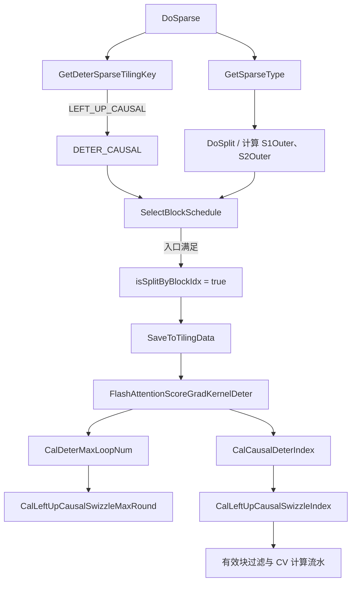

# FAG arch35 确定性 LEFT_UP_CAUSAL 非等长 Swizzle 设计文档

| 项目         | 内容                                                                   |
| ------------ | ---------------------------------------------------------------------- |
| 文档版本     | v1.0                                                                   |
| 日期         | 2026-08-28                                                             |
| 状态         | 设计与当前实现对齐                                                     |
| 目标平台     | arch35（Ascend 950PR/Ascend 950DT）                                    |
| 目标场景     | 非 TND、确定性计算、`sparseMode=2`、`G=1`、`S1 != S2`            |
| 算子代码基线 | `ops-transformer` 分支 `david_0827_log_fix`，提交 `a5fcada556ac` |
| Python 镜像  | [`casual.py`](./casual.py)                                            |

> 说明：文件名 `casual.py` 以及代码中的 `SparseType::CASUAL` 沿用仓库现有拼写，本文统一使用语义正确的 **causal** 表述。

## 1. 摘要

本文设计将 FAG arch35 确定性 `LEFT_UP_CAUSAL` 的 Swizzle 调度从等长 `S1 == S2` 扩展到非等长 `S1 != S2`，目标是在不改变算子 API、Tiling ABI 和主体计算流水的前提下，完成有效 `(B*N2, S1Outer, S2Outer)` 基本块的无遗漏、无重复分发，并满足确定性计算所需的写冲突约束。

方案按 `S1Outer` 与 `S2Outer` 的关系分为两类：

- `S1Outer <= S2Outer`：超出 `S1Outer` 的 S2 列在左上 causal 下整体无效，将问题裁剪为方形下三角，复用已有双 Batch causal Swizzle。
- `S1Outer > S2Outer`：每两个相邻融合 Batch 配成一组，把两个下三角梯形的互补列拼成等高虚拟列，再按虚拟矩形分核。

当前实现通过 Host 侧的 `isSplitByBlockIdx` 选择新调度，Kernel 侧自行计算最大轮次和坐标，不新增 Tiling 字段。Python 镜像穷举验证 `16,384` 组参数、`3,198,720` 个有效坐标，全部通过。

## 2. 背景与问题定义

FAG 反向计算可简化为：

\[
dV=P^T dY,\qquad dQ=(dS)K\cdot scale,\qquad dK=(dS)^TQ\cdot scale
\]

确定性场景不能依赖多个核以不固定顺序累加同一输出地址。对于按 `S1/S2` 基本块切分的模板，调度至少要保证：

1. 同一轮内，同一融合 Batch 的同一 `S1` 行只被一个核处理，避免 `dQ` 同地址并发写。
2. 同一融合 Batch 的同一 `S2` 列固定归属一个物理核，保证 `dK/dV` 列方向的累加顺序稳定。
3. 所有 causal 有效块恰好计算一次。

等长场景可以把相邻两个 Batch 的三角区拼成矩形；非等长场景的有效区变为三角形或梯形，直接沿用等长公式会产生漏块、重复块、列跨核或轮次估计不匹配。

## 3. 设计范围

### 3.1 范围内

- arch35 确定性 Kernel。
- 非 TND layout。
- `sparseMode == LEFT_UP_CAUSAL(2)`。
- `G == 1`，即 NoGQA。
- `S1Outer < S2Outer`、`S1Outer == S2Outer`、`S1Outer > S2Outer`。
- `B*N2` 为正偶数。
- `BN2GS1S2` 核间切分模板，两侧 Cube 基本块相等。

### 3.2 范围外

- TND/变长序列调度。
- `G > 1` 的 GQA causal 调度。
- 奇数 `B*N2` 的尾 Batch 特化。
- 两侧 Cube 基本块不相等的 split mode 1/2。
- `RIGHT_DOWN_CAUSAL`、`BAND` 和一般 `NO_MASK` 的调度重构。
- FAG 数学计算、数据类型、API、workspace 和 CV 流水本身的修改。

## 4. 术语与参数映射

Python 镜像和 Kernel helper 均采用 1-based 坐标。参数对应关系如下。

| 符号        | Python            | Host/Kernel 含义                                                              |
| ----------- | ----------------- | ----------------------------------------------------------------------------- |
| `k`       | `k`             | 可参与调度的 Cube 核数；Kernel 中为`coreNum / 2`，目标平台上对应 `aicNum` |
| `m`       | `m`             | `s1Outer`，S1 方向基本块数量                                                |
| `n`       | `n`             | `s2Outer`，S2 方向基本块数量                                                |
| `b`       | `b`             | 融合 Batch 数`B * N2`，不是单独的 B 轴大小                                  |
| `j`       | `core_id`       | 1-based Cube 核编号，即`cBlockIdx + 1`                                      |
| `r`       | `round_id`      | 1-based 调度轮次，即 Kernel`roundId + 1`                                    |
| `(w,x,y)` | `(batch,s1,s2)` | 1-based 融合 Batch、S1 块、S2 块坐标                                          |
| `P`       | `pair_count`    | 相邻融合 Batch 对数，`P=b/2`                                                |

Kernel 得到 `w` 后，再按 `N2` 维将它拆回真实的 `batchId` 和 `n2Idx`。目标场景 `G=1`，因此不需要额外的 G 轴映射。

左上 causal 的块级有效集合为：

\[
\Omega=\{(w,x,y)\mid 1\le w\le b,\ 1\le x\le m,\ 1\le y\le n,\ y\le x\}
\]

## 5. 总体调用链



关键点如下：

- `GetDeterSparseTilingKey` 将 `LEFT_UP_CAUSAL` 映射为 `DETER_CAUSAL`。
- `SelectBlockSchedule` 在切分完成后决定是否使用按 BlockIdx 的 Swizzle。
- Host 仅下发既有字段 `isSplitByBlockIdx`，不下发新的虚拟矩形参数。
- Kernel 基于 `k/m/n/b` 重新计算轮次和坐标，保证轮次公式与坐标公式在同一实现层闭环。
- `CalDeterIndex` 跳过无效槽位，后续 Matmul、Vector 和同步流水保持不变。

## 6. Host 侧设计

### 6.1 确定性 sparse 类型选择

`GetDeterSparseTilingKey` 对 `LEFT_UP_CAUSAL` 返回 `DETER_CAUSAL`，与 `S1/S2` 是否等长无关。`GetSparseType` 在非 TND 下可能根据几何把场景标记为 `CASUAL` 或 `BAND`，但只要不是 `UNSUPPORTED`，都可以进入本设计的 `DETER_CAUSAL` Swizzle 入口。

因此，需要区分两个概念：

- `deterSparseType` 决定确定性 Kernel 的坐标算法分支。
- `sparseType` 用于判断当前稀疏场景是否受既有模板支持。

### 6.2 Swizzle 入口条件

目标场景的等价入口条件为：

```text
enableSwizzle
&& layoutType != TND
&& splitAxis == BN2GS1S2
&& s1Inner * s1CvRatio == s2Inner * s2CvRatio
&& sparseType != UNSUPPORTED
&& isDeterministic
&& (B * N2) > 0
&& (B * N2) % 2 == 0
&& G == 1
&& S1 >= aicNum * 128
&& deterSparseType == DETER_CAUSAL
&& sparseMode == LEFT_UP_CAUSAL        // 本文目标子场景
```

| 条件                 | 设计原因                                                    |
| -------------------- | ----------------------------------------------------------- |
| 非 TND               | TND 使用独立的前缀和及变长坐标算法                          |
| `BN2GS1S2`         | 新公式面向 S1/S2 外层基本块分核                             |
| Cube 基本块相等      | 保证`y <= x` 可以直接在块坐标上表达，避免 split mode 变换 |
| 确定性计算           | 本方案服务于确定性写冲突约束                                |
| `B*N2` 为偶数      | 每两个融合 Batch 拼成一个虚拟矩形                           |
| `G=1`              | GQA 使用另一套 causal 坐标公式                              |
| `S1 >= aicNum*128` | 沿用已有 Swizzle 性能门槛，避免小规模场景调度开销大于收益   |
| sparse 受支持        | 保留既有稀疏有效块过滤能力                                  |

`SelectBlockSchedule` 的 `causalCond` 在代码中以 `deterSparseType == DETER_CAUSAL` 表达，因此还可能覆盖兼容的 `NO_MASK` 或旧 causal 子场景；本文只承诺 `sparseMode=2` 的行为。`RIGHT_DOWN_CAUSAL` 原入口有单独的提前返回，保持旧调度不变。

### 6.3 Tiling 数据

本设计复用 `s1s2BNGS1S2BaseParams.isSplitByBlockIdx`：

- `false`：Kernel 使用原确定性 causal 坐标和 Host 下发的 `deterMaxRound`。
- `true`：Kernel 使用本设计的 `CalLeftUpCausalSwizzleMaxRound` 和 `CalLeftUpCausalSwizzleIndex`。

不新增结构体字段，不改变 TilingKey 位域，不产生 Host/Kernel ABI 兼容性问题。

## 7. Kernel 调度设计

### 7.1 公共定义

令：

\[
P=\frac{b}{2}
\]

`activeK` 表示实际参与坐标生成的核数。物理核编号 `j > activeK` 时直接返回无效坐标，避免有效列数少于物理核数时发生越界或重复分发。

### 7.2 场景一：`m <= n`

左上 causal 满足 `y <= x`，而 `x <= m`，所以 `y > m` 的 S2 列整体无效。调度时将 `n` 裁剪为 `m`，复用边长为 `m` 的方形 causal Swizzle。

每两个 Batch 的两个下三角各有 `m(m+1)/2` 个有效块，合计正好拼成 `m × (m+1)` 的虚拟矩形：

\[
virtualM=m,\qquad virtualN=m+1
\]

\[
activeK=\min(k,mP)
\]

\[
maxRound=virtualM\cdot\left\lceil\frac{virtualN\cdot P}{activeK}\right\rceil
=m\cdot\left\lceil\frac{(m+1)P}{activeK}\right\rceil
\]

坐标生成调用：

```cpp
CalCausalSwizzleIndex(activeK, m, m, b, j, r, coordinate);
```

这样既复用已有等长映射，也不会访问原始 `n` 中超出 `m` 的无效列。

### 7.3 场景二：`m > n`

每个 Batch 的有效区是宽 `n`、左侧列较长的下三角梯形。对每个 Batch 对和虚拟列 `y∈[1,n]`：

- 奇数 Batch 使用实际列 `y`，有效长度为 `m-y+1`。
- 偶数 Batch 使用互补实际列 `n-y+1`，有效长度为 `m-n+y`。

二者相加为常数：

\[
(m-y+1)+(m-n+y)=2m-n+1
\]

因此可构造等高虚拟矩形：

\[
virtualM=2m-n+1,\qquad virtualN=n
\]

\[
activeK=\min(k,nP)
\]

\[
maxRound=virtualM\cdot\left\lceil\frac{virtualN\cdot P}{activeK}\right\rceil
=(2m-n+1)\cdot\left\lceil\frac{nP}{activeK}\right\rceil
\]

### 7.4 `m > n` 坐标公式

首先根据核和轮次确定虚拟列：

\[
columnId=\left\lfloor\frac{r-1}{virtualM}\right\rfloor activeK+j-1
\]

若 `columnId >= nP`，当前槽位为空。否则：

\[
pairId=\left\lfloor\frac{columnId}{n}\right\rfloor+1
\]

\[
virtualS2=columnId\bmod n+1
\]

\[
virtualS1=(r-1)\bmod virtualM+1
\]

令奇数 Batch 段长度：

\[
oddBatchLen=m-virtualS2+1
\]

映射规则为：

```text
if virtualS1 <= oddBatchLen:
    batch = 2 * pairId - 1
    s1    = virtualS2 + virtualS1 - 1
    s2    = virtualS2
else:
    evenOffset = virtualS1 - oddBatchLen
    batch = 2 * pairId
    s1    = m - evenOffset + 1
    s2    = n - virtualS2 + 1
```

偶数 Batch 段采用逆序 S1 映射，使同一轮不同虚拟列不会落到相同的 `(batch,s1)`，同时保持每个实际 S2 列只归属一个物理核。

### 7.5 Kernel 执行闭环

`CalDeterMaxLoopNum` 在 `DETER_CAUSAL && isSplitByBlockIdx` 时调用新的最大轮次函数。`CalCausalDeterIndex` 对每个 `roundId` 调用坐标函数，随后：

1. 将融合 Batch 坐标拆成 B/N2/G 坐标。
2. 转成 Kernel 内部 0-based 坐标。
3. 通过 `IsValidForDeter` 做元素尾块和稀疏边界过滤。
4. `CalDeterIndex` 向后扫描到下一个有效轮次。
5. `Process_NEW_DETER` 沿用原 ping-pong CV 流水执行有效基本块。

最大轮次负责覆盖虚拟矩形，坐标函数负责将矩形槽位映射到真实 causal 区，既有有效性检查负责过滤块内尾部；三层职责互不混淆。

## 8. 正确性分析

### 8.1 完备性

- `m <= n`：原有效集合等价于边长 `m` 的下三角，双 Batch 拼接覆盖两个三角的全部坐标。
- `m > n`：每个虚拟列严格由奇数 Batch 的列 `y` 和偶数 Batch 的互补列 `n-y+1` 组成；遍历 `P` 个 Batch 对和 `n` 个虚拟列即可覆盖所有真实列。

### 8.2 无重复

- 每个 `columnId` 只由一个 `(j, round-window)` 生成。
- 每个虚拟列的奇、偶 Batch 段不相交。
- 不同 `pairId` 对应不同融合 Batch 对。

因此虚拟坐标到真实 `(batch,s1,s2)` 坐标是一一映射。

### 8.3 确定性约束

- 一个 `virtualM` 轮窗口内，物理核 `j` 对应固定 `columnId`；故真实 `(batch,s2)` 列不会跨核。
- 奇偶段的 S1 排列使同一轮的 `(batch,s1)` 坐标唯一；不同核不会在同轮处理同一 dQ 行。
- 相同输入 shape 的 `k/m/n/b` 固定，坐标顺序和累加顺序固定。

### 8.4 终止性

`maxRound` 是“每个虚拟列高度 × 覆盖全部虚拟列所需窗口数”。最后一个窗口不足 `activeK` 列时，多余核通过 `columnId >= virtualN*P` 返回无效。`maxRound+1` 之后不存在有效坐标。

## 9. 示例与开销

### 9.1 `S1Outer < S2Outer`

输入：`k/m/n/b = 28/33/49/18`

| 指标                    |                值 |
| ----------------------- | ----------------: |
| 模式                    | `TRIANGLE_PAIR` |
| `pairCount`           |                 9 |
| `virtualM / virtualN` |       `33 / 34` |
| `activeK`             |                28 |
| `maxRound`            |               363 |
| 理论有效块              |            10,098 |
| 实际发射坐标            |            10,098 |
| 空闲槽位                |                66 |
| 槽位利用率              |            99.35% |

有效块数满足：

\[
b\cdot\frac{m(m+1)}{2}=18\cdot\frac{33\cdot34}{2}=10098
\]

### 9.2 `S1Outer > S2Outer`

输入：`k/m/n/b = 28/49/33/18`

| 指标                    |                 值 |
| ----------------------- | -----------------: |
| 模式                    | `TRAPEZOID_PAIR` |
| `pairCount`           |                  9 |
| `virtualM / virtualN` |        `66 / 33` |
| `activeK`             |                 28 |
| `maxRound`            |                726 |
| 理论有效块              |             19,602 |
| 实际发射坐标            |             19,602 |
| 空闲槽位                |                726 |
| 槽位利用率              |             96.43% |

有效块数满足：

\[
b\cdot\left(n(m+1)-\frac{n(n+1)}{2}\right)
=18\cdot\left(33\cdot50-\frac{33\cdot34}{2}\right)=19602
\]

## 10. 验证方案与结果

### 10.1 Python 镜像验证

`casual.py` 逐核、逐轮镜像 Host 和 Kernel，验证以下不变量：

1. 实际坐标集合等于理论集合 `y <= x`。
2. 每个坐标只发射一次。
3. 每轮 `(batch,s1)` 唯一。
4. 每个 `(batch,s2)` 只归属一个物理核。
5. `maxRound` 后不存在有效坐标。
6. Host 偶数融合 Batch 入口为真，奇数入口为假。

已执行命令：

```powershell
python .\casual.py --case 28 33 49 18
python .\casual.py --case 28 49 33 18
python .\casual.py --full-test
```

执行结果：

```text
k/m/n/b=28/33/49/18 maxRound=363
mode=TRIANGLE_PAIR pairCount=9 virtualM/N=33/34 activeK=28
verify=PASS validBlocks=10098 issued=10098 idleSlots=66

k/m/n/b=28/49/33/18 maxRound=726
mode=TRAPEZOID_PAIR pairCount=9 virtualM/N=66/33 activeK=28
verify=PASS validBlocks=19602 issued=19602 idleSlots=726

PASS full-test cases=16384 coordinates=3198720
```

穷举范围为 `k,m,n∈[1,16]`、`b∈{2,4,6,8}`，覆盖三种长宽关系、有效核数少于物理核数、尾部虚拟列不足一组核等边界。

> 验证边界：Python 结果证明坐标公式之间自洽，但不能替代 C++ Kernel 编译、NPU 数值精度测试和重复执行的 bitwise 确定性测试。

### 10.2 建议补充的 Host UT

| 类别 | 用例                                    | 预期                         |
| ---- | --------------------------------------- | ---------------------------- |
| 正向 | `m<n`、偶数 `B*N2`、`G=1`、非 TND | `isSplitByBlockIdx=true`   |
| 正向 | `m>n`、偶数 `B*N2`、`G=1`、非 TND | `isSplitByBlockIdx=true`   |
| 兼容 | `m==n`                                | 结果与原 causal Swizzle 一致 |
| 反向 | 奇数`B*N2`                            | 不进入新 Swizzle             |
| 反向 | `G>1`                                 | 不进入新 Swizzle             |
| 反向 | TND                                     | 不进入本调度                 |
| 反向 | Cube 基本块不等                         | 不进入新 Swizzle             |
| 反向 | `S1<aicNum*128`                       | 不进入新 Swizzle             |
| 回归 | `RIGHT_DOWN_CAUSAL`                   | 保持 legacy 调度             |

### 10.3 建议补充的 Kernel/算子测试

- FP16、BF16 典型 D 值下，与 CPU 标杆比较 `dq/dk/dv`。
- `S1<S2`、`S1>S2`、块尾不对齐、不同 B/N2 组合。
- 同一输入连续执行多次，校验输出 bitwise 一致。
- 与关闭 Swizzle 的路径进行功能对比。
- 采集有效槽位率、总轮次和端到端耗时，确认相对 legacy 路径无性能回退。

## 11. 兼容性、风险与回退

| 项目            | 说明与处理                                                                 |
| --------------- | -------------------------------------------------------------------------- |
| API 兼容性      | 不修改 aclnn/图算子接口                                                    |
| Tiling 兼容性   | 复用`isSplitByBlockIdx`，不新增字段                                      |
| 等长回归        | `m==n` 进入 `m<=n` 分支并复用原 `CalCausalSwizzleIndex`              |
| 奇数融合 Batch  | 当前不配对，Host 禁用本路径并回退原调度                                    |
| GQA             | Host 以`G==1` 隔离，避免误用 NoGQA 公式                                  |
| TND             | Host 以 layout 隔离，继续使用 TND 专用算法                                 |
| 尾块            | 坐标层按外层块调度，块内有效性继续由`IsValidForDeter` 过滤               |
| 空闲槽位        | 最后窗口可能存在，Kernel 返回无效坐标；需用性能用例监控极端比例            |
| Python/C++ 漂移 | 将脚本公式对应到 C++ 单测或共享测试向量，代码变更时同步执行`--full-test` |

回退方式是让 Host 的 `isSplitByBlockIdx` 保持为 `false`，Kernel 即恢复使用原确定性 causal 坐标和 `deterMaxRound`；无需修改接口或数据结构。

## 12. 源码对应关系

| 模块             | 文件与位置                                                                                                                                                                                                                              | 作用                               |
| ---------------- | --------------------------------------------------------------------------------------------------------------------------------------------------------------------------------------------------------------------------------------- | ---------------------------------- |
| Python Host 镜像 | [`casual.py`](./casual.py)，`host_enables_left_up_causal_swizzle`（约第 53 行）                                                                                                                                                      | Swizzle 外围条件                   |
| Python 轮次镜像  | [`casual.py`](./casual.py)，`calc_left_up_causal_swizzle_schedule`（约第 153 行）                                                                                                                                                    | 虚拟矩形与最大轮次                 |
| Python 坐标镜像  | [`casual.py`](./casual.py)，`cal_left_up_causal_swizzle_index`（约第 186 行）                                                                                                                                                        | 逐核逐轮坐标                       |
| Python 验证      | [`casual.py`](./casual.py)，`verify_case` / `run_full_test`（约第 260/298 行）                                                                                                                                                     | 不变量与穷举验证                   |
| Host 入口        | [`flash_attention_score_grad_tiling_normal_regbase.cpp`](../../../../ops-transformer/attention/flash_attention_score_grad/op_host/arch35/flash_attention_score_grad_tiling_normal_regbase.cpp)，`SelectBlockSchedule`（约第 341 行） | 决定`isSplitByBlockIdx`          |
| Host 类型路由    | 同上，`GetDeterSparseTilingKey`（约第 1207 行）                                                                                                                                                                                       | `LEFT_UP_CAUSAL -> DETER_CAUSAL` |
| Host 数据落盘    | 同上，约第 2305 行                                                                                                                                                                                                                      | 写入`isSplitByBlockIdx`          |
| Kernel 公共算法  | [`deter.h`](../../../../ops-transformer/attention/flash_attention_score_grad/op_kernel/arch35/deter.h)，约第 708/726 行                                                                                                                | 最大轮次与坐标公式                 |
| Kernel 路由      | [`flash_attention_score_grad_kernel_deter.h`](../../../../ops-transformer/attention/flash_attention_score_grad/op_kernel/arch35/flash_attention_score_grad_kernel_deter.h)，约第 342/598/766 行                                        | causal 坐标、轮次和有效块扫描      |
| Kernel 流水      | 同上，`Process_NEW_DETER`（约第 817 行）                                                                                                                                                                                              | 执行确定性 CV 计算流水             |

## 13. 验收标准

设计验收需同时满足：

1. `m<n`、`m==n`、`m>n` 的 Host 路由符合入口约束。
2. 有效块覆盖率 100%，无重复坐标、越界坐标和 `maxRound` 后有效坐标。
3. 每轮 `(batch,s1)` 唯一，每个 `(batch,s2)` 固定在同一核。
4. NPU 数值结果满足算子精度标准，重复执行结果 bitwise 一致。
5. 等长 causal、`RIGHT_DOWN_CAUSAL`、TND、GQA 和奇数融合 Batch 路径无功能回归。
6. 典型非等长 shape 相比关闭 Swizzle 的 legacy 路径无可接受范围外的性能回退。
